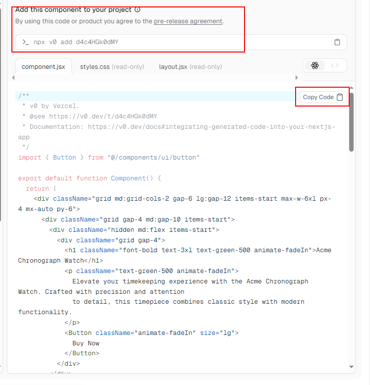
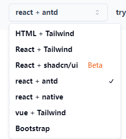

# 背景

随着 AI 的发展，相信作为一个会偷懒的程序员，或多或少已经用过了不少 AI 产品，诸如 ChatGPT、Bing、MJ 等等聊天，绘画工具
那么通过使用 AI 技术来生成网站，可以大大减少网站提升开发效率

# AI 生成网站 支持文字和截图

1. 比较出名的自然是 vercel 推出的代码自动生成平台 https://v0.dev/，可以从v0 开始不断根据输入对话交互迭代生成你的页面，且可以通过命令行和 nextjs 深度集成，也能直接拷贝代码粘贴到 react 生态中

## 随之而来的问题

虽然生成的代码质量稳定，但是 vercel 作为 next.js 的开发厂商，只支持 react 生态的代码，那么我们想要快速生成 vue 以及 angular 或其它框架的代码，那么有没有什么类似的工具呢？

首先想到的是直接生成 vue 代码网站

1.  [直接生成 vue 代码网站](https://www.vue0.dev/)

2.  或者曲线救国 react 与 vue 等互转，先通过 vercel v0 生成 react 代码，再通过 react 转 vue
    https://runjs.work/code-converter/vue-to-react

## 结合

虽然一些取巧的办法能够解决上述问题，那么有没有什么网站能支持多样版本的代码生成呢？这样可以省去一些转换步骤，毕竟有时候只是想快速生成一个页面，之后还是得手动调整

已经有

1.  https://www.ancodeai.com/ 支持生成多样的代码 

## 想象中的特性

1. 支持不同厂商不同模型的自由选择
2. 支持不同框架+不同 UI 的自由选择
3. 调教代码生成稳定性与细节交互迭代，参考 sd 的

想法很美好，但是想让 AI 达成和需求完美结合使用离不开工程师不断的调教

# 参考资料

https://juejin.cn/post/7316796251149090851
https://github.com/sparrow-js/an-codeAI
