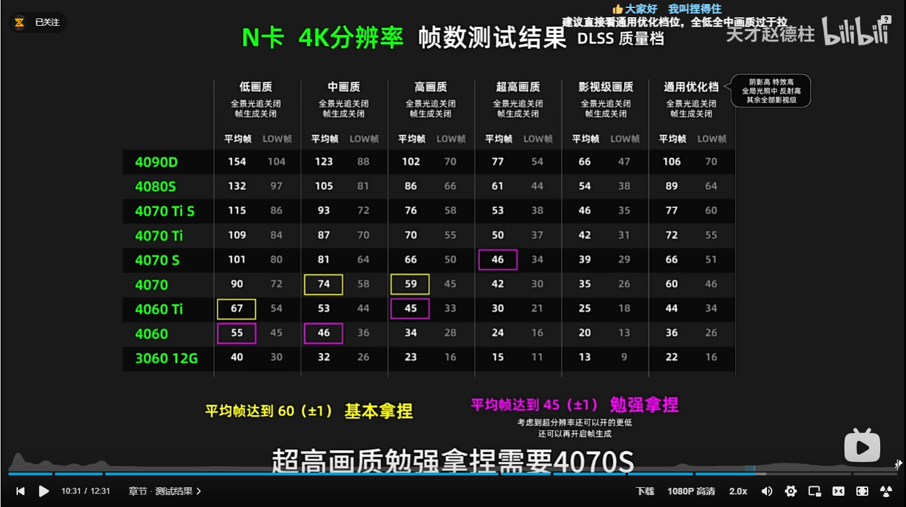
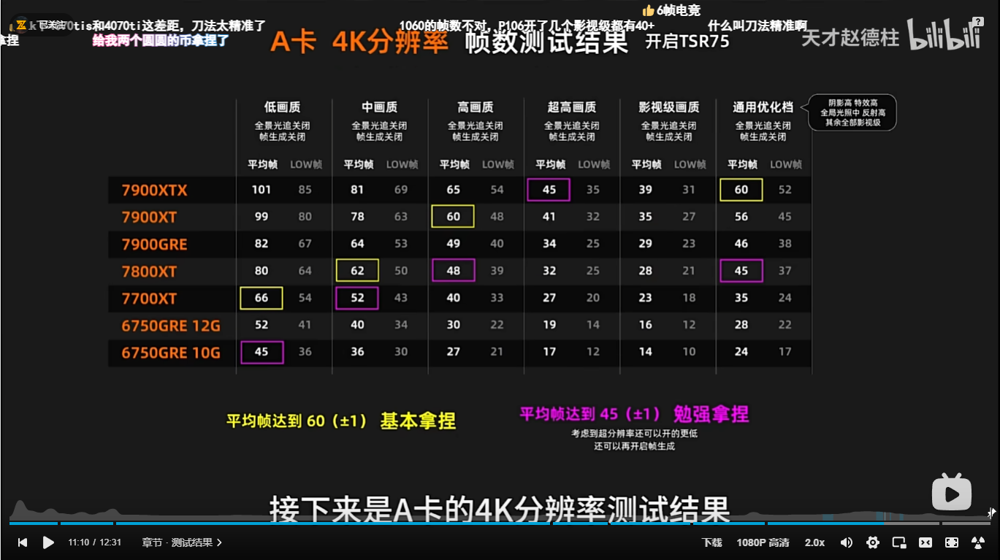
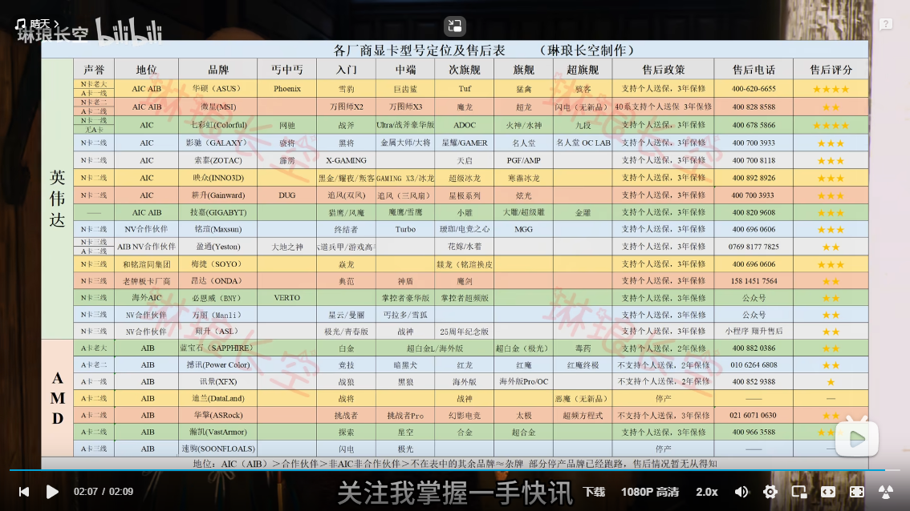
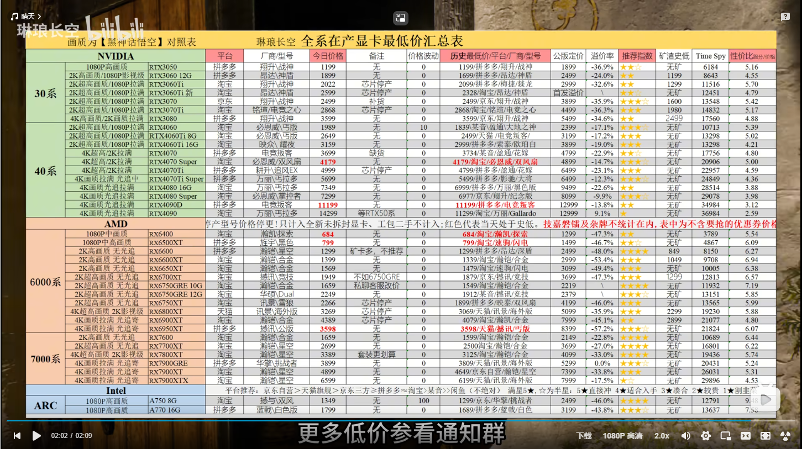

# 购物

1. 确定需求和价格
1. 不同媒体 B 站 小红书 什么值得买 测评不是推荐
1. 不同电商平台的排行

# 笔记本

1. 噪音
2. 麦克风

ZOO 自搭 1487 + 639 + 399 + 3500 + 137 + 305 + 100 = 6557 8 月初价格 R5-7500F + 7800xt

## 需求

1. 27 寸 4k
2. 光追与非光追区别？

# 自己组装 DIY-小程序

# DIY

1. 3A+网游 测试
2. 生产力测试
3. 主板的后续扩展性
4. 炫酷的外观

## 黑神话显卡测试图 无光追 优化档 2K 畅玩 4K 入门 显卡帧数测试

1. 4K N 卡 
2. 4K A 卡 
3. 各产品代号定位 
4. 显卡低价 
   显示器 4k 165hz 1600
   装机套装组合 R5 7500F + 7800xt
